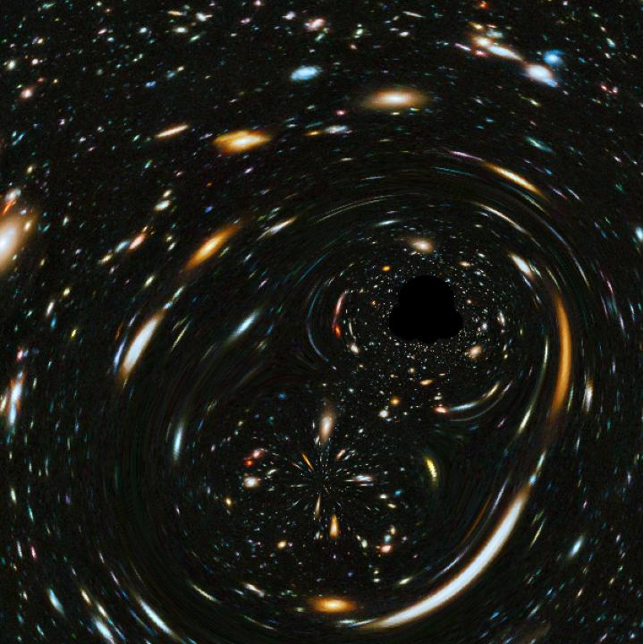

# Gravitational Lensing Image Generator

## Structure

- `code/main.py`: Classes with methods to generate the images
- `code/plot_utils.py`: Utility functions for plotting.
- `code/example_usage.ipynb`: Notebook with examples. 

## How to Use

Use the `/example_usage.ipynb` notebook as a reference. 

For the physics behind the phenomena, you could consult Schneider, P. (2005, July). Gravitational lensing statistics.

## Requirements

Numpy and matplotlib should be enough.

## Contributing

Contributions are welcome! 

## Aknowledgments

Part of this code was first introduced to me in a course at the master in astrophysics of Universidad de La Laguna (ULL)

## License

Distributed under the MIT License. See `LICENSE` for more information.
